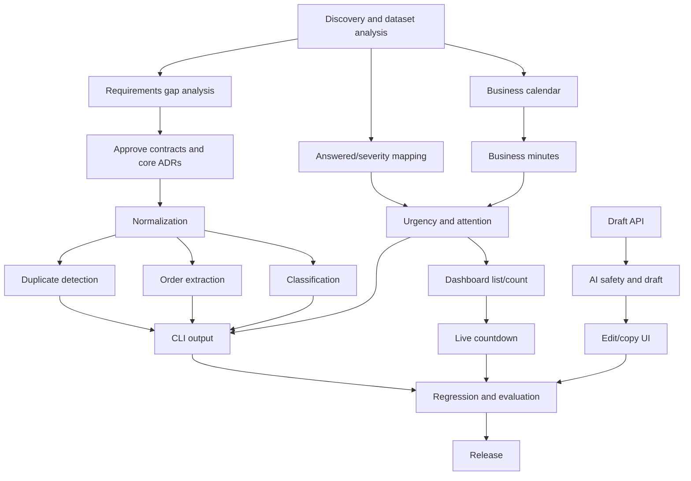

# Task Dependencies

```mermaid
flowchart TD
  DISC[Discovery and dataset analysis] --> REQ[Requirements gap analysis]
  REQ --> ADR[Approve contracts and core ADRs]
  ADR --> NORM[Normalization]
  NORM --> DUP[Duplicate detection]
  NORM --> ORDER[Order extraction]
  NORM --> CLASS[Classification]
  DISC --> ANSWER[Answered/severity mapping]
  DISC --> CAL[Business calendar]
  CAL --> SLA[Business minutes]
  ANSWER --> URG[Urgency and attention]
  SLA --> URG
  DUP --> CLI[CLI output]
  ORDER --> CLI
  CLASS --> CLI
  URG --> CLI
  URG --> UI[Dashboard list/count]
  UI --> CLOCK[Live countdown]
  API[Draft API] --> DRAFT[AI safety and draft]
  DRAFT --> EDIT[Edit/copy UI]
  CLI --> QA[Regression and evaluation]
  CLOCK --> QA
  EDIT --> QA
  QA --> RELEASE[Release]
```

Frontend shell/RTL work can begin while backend modules are being implemented, but integration depends on agreed API/data contracts.
